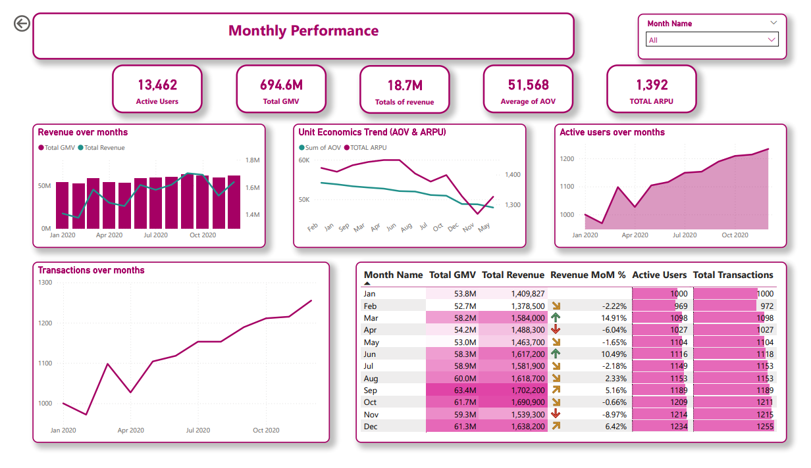
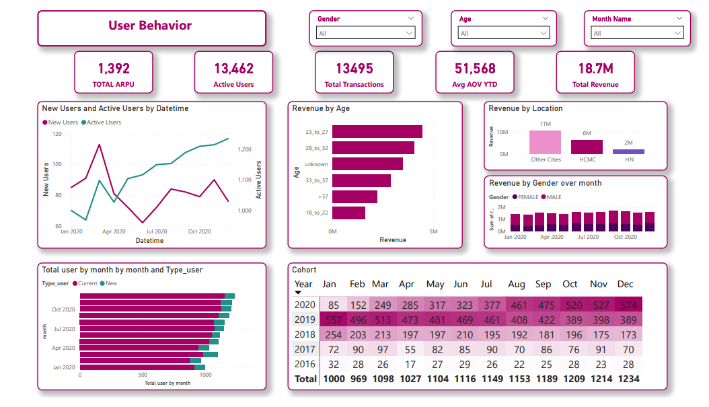
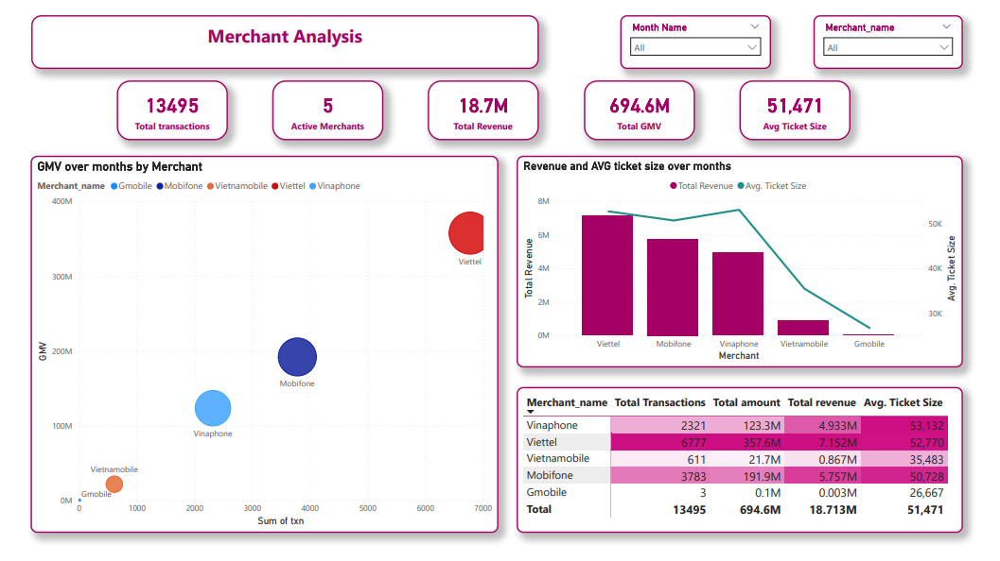

# MoMo Top-up User Behavior Analysis

## Project Overview

This project analyzes **top-up transactions on the MoMo e-wallet platform** to identify **user behavior patterns and transaction trends**.

The analysis transforms raw transaction data into structured **analytics-ready datasets (Data Marts)** using **Python & Pandas** to support behavioral insights and interactive dashboard visualization.

The project follows a typical **data analytics workflow** including data exploration, data cleaning, feature engineering, and analytics mart construction.

---

##  Key Business Insights
* **Revenue Concentration:** Discovered that the **top 20% of users contributed 65% of the total revenue**, highlighting a strong reliance on high-value customers.
* **Transaction Behavior:** Identified that the average ticket size remains stable at ~51K VND, meaning overall platform growth is driven by **increasing user activity frequency** rather than larger basket sizes.
* **Monthly Trends:** Observed seasonal peaks in transaction volume during **Q3–Q4**, suggesting a strong correlation with year-end promotional campaigns.

*For detailed analysis and recommendations [Insights Report](Reports/Insights.md).*

---

## Dashboard Preview

### 1. Monthly Performance


### 2. User Behavior


### 3. Merchant Analysis


---

## Project Objectives

* Understand **user top-up behavior**
* Identify **transaction patterns**
* Analyze **monthly transaction performance**
* Build **analytics datasets for dashboard visualization**

---

## Analytics Pipeline

| Stage                   | Description                                                         | Notebook                        |
| ----------------------- | ------------------------------------------------------------------- | ------------------------------- |
| Data Understanding      | Explore dataset structure, inspect missing values, detect anomalies | `01_data_understanding.ipynb`      |
| Data Cleaning           | Handle missing values, fix inconsistencies, correct data types      | `02_data_cleaning.ipynb`           |
| Feature Engineering     | Create analytical features such as revenue and behavioral metrics   | `03_feature_engineering.ipynb`     |
| Analytics Mart Building | Transform processed data into dimensional datasets for visualization| `04_building_analytics_mart.ipynb` |

---

## Project Structure

text
```
momo_topup_analysis/
│
├── Dashboard/               <- Power BI files and exported visuals
│   ├── Merchant_analysis.png
│   ├── Monthly_performance.png
│   ├── User_behavior.png
│   ├── visualization.pbix   <- Interactive Power BI dashboard file
│   └── visualization.pdf    <- Exported report for quick review
│
├── Data/                    
│   ├── raw/                 <- Original unstructured data
│   ├── processed/           <- Cleaned and transformed data
│   └── mart/                <- Final tables ready for Power BI
│
├── Notebooks/               <- Jupyter notebooks for ETL and EDA
│   ├── 01_data_understanding.ipynb
│   ├── 02_data_cleaning.ipynb
│   ├── 03_feature_engineering.ipynb
│   └── 04_building_analytics_mart.ipynb
│
├── Reports/                 <- Documentation and findings
│   └── Insights.md          <- Detailed business insights and recommendations
│
├── .gitignore               <- Specifies intentionally untracked files to ignore
└── README.md                <- The top-level README for developers/viewers
```
---
## Data Architecture

The project follows a layered analytics structure:

| Layer | Description |
| :--- | :--- |
| **Raw Data** | Original transaction dataset |
| **Clean Data** | Data after preprocessing and validation |
| **Feature Layer** | Engineered features for analysis |
| **Analytics Mart** | Aggregated datasets used for BI dashboards |
---

## Key Analytical Focus

The analysis focuses on identifying:

* **User transaction frequency**
* **Top-up behavior patterns**
* **Monthly transaction trends**
* **Revenue distribution**
* **User segmentation**

---

## Key Metrics

| Metric | Description |
| :--- | :--- |
| **Total Transactions** | Total number of top-up transactions |
| **Total Revenue** | Revenue generated from transactions |
| **Average Order Value (AOV)** | Average value per transaction |
| **Transaction Frequency** | Average number of transactions per user |
| **Active Users** | Number of users performing transactions |

---

## Tech Stack

   
